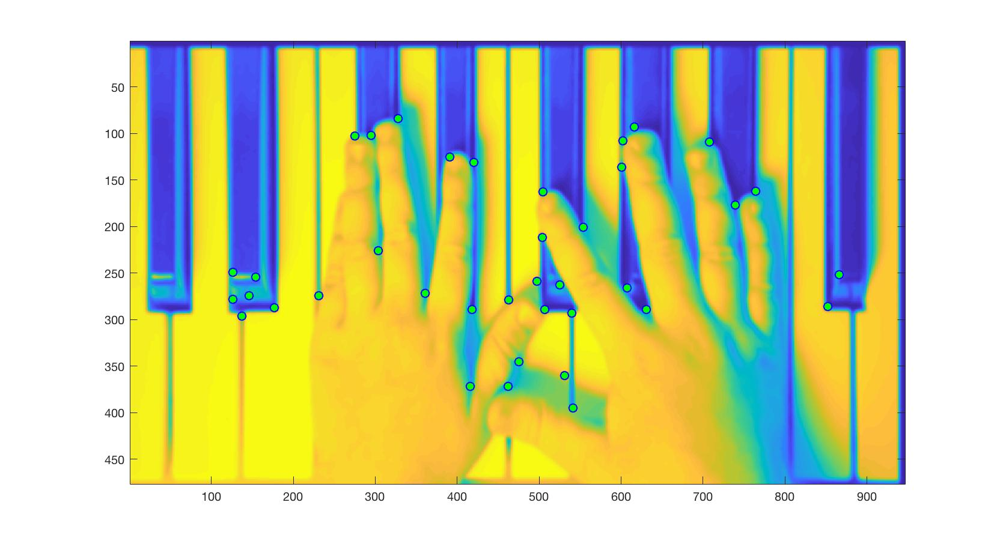

# Lucas Kanade Tracker

In this project I found good features (points) for an image of a hand for tracking using the lucas kanade algorithm. 

### Good features to track plotted on an image
You can see here that good features are frequently found on edges 

